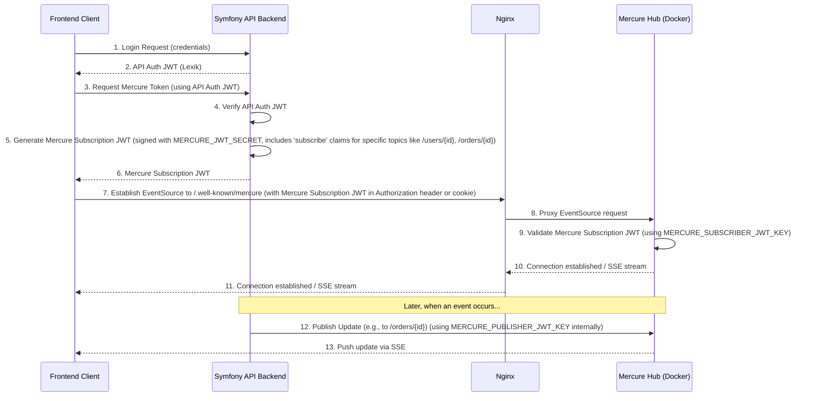

# Mercure Integration Plan: Review and Configuration

This document outlines the plan for implementing real-time notifications using Mercure, focusing on configuration review, JWT integration, and recommendations.

## Phase 1: Review Existing Configuration (Completed)

The following files were examined:
1.  `backend/config/packages/mercure.yaml`: Configured to use environment variables for URLs and JWT secret. Allows publishing and subscribing to all topics (`*`) if a valid JWT is provided.
2.  `backend/.env`: Contains placeholder values:
    *   `MERCURE_URL=https://example.com/.well-known/mercure`
    *   `MERCURE_PUBLIC_URL=https://example.com/.well-known/mercure`
    *   `MERCURE_JWT_SECRET="!ChangeThisMercureHubJWTSecretKey!"`
3.  `docker-compose.yml`:
    *   Defines a `mercure` service (`dunglas/mercure`).
    *   The Mercure hub service uses `MERCURE_JWT_SECRET` for `MERCURE_PUBLISHER_JWT_KEY` and `MERCURE_SUBSCRIBER_JWT_KEY`.
    *   `MERCURE_EXTRA_DIRECTIVES` includes `cors_origins *` and, critically, `anonymous`, allowing unauthenticated subscriptions.
    *   The `backend` service is configured with:
        *   `MERCURE_URL: ${MERCURE_URL:-http://mercure/.well-known/mercure}` (internal Docker network)
        *   `MERCURE_PUBLIC_URL: ${MERCURE_PUBLIC_URL:-http://localhost:3000/.well-known/mercure}` (direct to Mercure container, bypassing Nginx by default for clients)
        *   `MERCURE_JWT_SECRET: ${MERCURE_JWT_SECRET:-!ChangeThisMercureHubJWTSecretKey!}`
4.  `docker/nginx/conf.d/default.conf`:
    *   Correctly proxies requests from `/.well-known/mercure` (on port 80, then redirected to 443) to the internal Mercure service `http://mercure:3000/.well-known/mercure`.
    *   Includes necessary headers for Server-Sent Events (SSE).
5.  `backend/config/packages/lexik_jwt_authentication.yaml`: Standard setup using asymmetric keys (`JWT_SECRET_KEY`, `JWT_PUBLIC_KEY`) and `JWT_PASSPHRASE`. Token TTL is 3 days. This is separate from Mercure's JWT mechanism.

## Phase 2: JWT Integration Plan

The core challenge is integrating Mercure's JWT requirements with the existing LexikJWTBundle authentication. Mercure uses a symmetric JWT secret, while LexikJWTBundle in this project uses asymmetric keys.

**Strategy:**
We will use two distinct JWTs:
1.  **API Authentication JWT:** The existing token generated by LexikJWTBundle. Used by the frontend to authenticate with the Symfony API.
2.  **Mercure Subscription JWT:** A new, separate token generated by the Symfony backend specifically for authorizing frontend subscriptions to the Mercure hub. This token will be signed using the `MERCURE_JWT_SECRET`.

**Flow:**



**Details:**

*   **Publishing (Symfony to Mercure Hub):**
    *   The Symfony Mercure bundle will use the `MERCURE_JWT_SECRET` (from `.env`) to internally sign a JWT when publishing updates. The `mercure` service in `docker-compose.yml` is correctly configured with `MERCURE_PUBLISHER_JWT_KEY: ${MERCURE_JWT_SECRET}`.
*   **Subscribing (Frontend Client to Mercure Hub):**
    1.  **Secure Subscriptions:** The `anonymous` directive in the Mercure service's `MERCURE_EXTRA_DIRECTIVES` in `docker-compose.yml` **must be removed**.
    2.  **Generate Mercure Subscription JWT:**
        *   The Symfony backend will provide a new API endpoint (e.g., `/api/mercure/token`).
        *   This endpoint will be protected and require a valid API Authentication JWT (Lexik).
        *   Upon successful authentication, this endpoint will generate a Mercure Subscription JWT.
        *   This JWT will be signed with `MERCURE_JWT_SECRET`.
        *   It will contain a `mercure: { subscribe: ["topic1", "user/{id}", ...] }` claim, specifying exactly which topics the authenticated user/restaurant is allowed to subscribe to. This prevents unauthorized data access.
    3.  **Frontend Usage:** The frontend client will call this new endpoint to obtain the Mercure Subscription JWT. It will then use this token (e.g., in the `Authorization: Bearer <token>` header) when creating the `EventSource` connection to the `MERCURE_PUBLIC_URL`.

## Phase 3: Configuration Recommendations

1.  **Environment Variables (`.env`, `.env.example`, etc.):**
    *   **`MERCURE_JWT_SECRET`**:
        *   **Action:** Generate a strong, unique, random string (at least 32 characters).
        *   **Example:** `MERCURE_JWT_SECRET="your_strong_random_mercure_secret_key_here"`
        *   **Note:** This secret must be identical in the Symfony backend configuration and the Mercure hub Docker service configuration.
    *   **`MERCURE_URL`** (for Symfony backend publishing):
        *   **Action:** Ensure it points to the internal Docker service name for Mercure.
        *   **Value:** `MERCURE_URL="http://mercure/.well-known/mercure"` (The default in `docker-compose.yml` for the backend service is correct).
    *   **`MERCURE_PUBLIC_URL`** (for client subscriptions):
        *   **Action:** Ensure it points to the Nginx proxy for Mercure, not directly to the Mercure container's port.
        *   **Value (local development, Nginx with SSL):** `MERCURE_PUBLIC_URL="https://localhost/.well-known/mercure"`
        *   **Value (production):** `MERCURE_PUBLIC_URL="https://your-actual-domain.com/.well-known/mercure"`

2.  **Docker Compose (`docker-compose.yml`):**
    *   **`mercure` service:**
        *   `MERCURE_PUBLISHER_JWT_KEY`: Keep as `${MERCURE_JWT_SECRET}`.
        *   `MERCURE_SUBSCRIBER_JWT_KEY`: Keep as `${MERCURE_JWT_SECRET}`.
        *   `MERCURE_EXTRA_DIRECTIVES`:
            *   **Action:** Remove `anonymous`. Restrict `cors_origins`.
            *   **Change from:**
                ```yaml
                MERCURE_EXTRA_DIRECTIVES: |
                  cors_origins *
                  anonymous
                ```
            *   **Change to (example):**
                ```yaml
                MERCURE_EXTRA_DIRECTIVES: |
                  cors_origins 'https://localhost:5173 http://localhost:5173 https://your-frontend-domain.com' # Adjust to your frontend origins
                  # debug # Optionally add for development debugging
                ```
    *   **`backend` service:**
        *   The `MERCURE_PUBLIC_URL` default should be updated to reflect Nginx proxying:
            *   **Change from:** `MERCURE_PUBLIC_URL: ${MERCURE_PUBLIC_URL:-http://localhost:3000/.well-known/mercure}`
            *   **Change to (assuming local Nginx SSL):** `MERCURE_PUBLIC_URL: ${MERCURE_PUBLIC_URL:-https://localhost/.well-known/mercure}`

3.  **Symfony Mercure Configuration (`backend/config/packages/mercure.yaml`):**
    *   No changes are strictly necessary as it correctly uses environment variables. The `publish: '*'` is generally fine for the backend. The `subscribe: '*'` in this file refers to the default behavior if a JWT with such a claim is presented to the hub, which we will control via the JWTs we generate.

4.  **Nginx Configuration (`docker/nginx/conf.d/default.conf`):**
    *   The existing `location /.well-known/mercure` block is largely correct.
    *   Minor cleanup: There's a duplicate `proxy_set_header Connection "";` line. One is sufficient. The line `proxy_set_header Connection '';` (with single quotes) is effective for SSE.
    *   Ensure `server_name` and `listen` directives correctly correspond to the `MERCURE_PUBLIC_URL` (e.g., `localhost` and `listen 443 ssl` for `https://localhost/...`).

## Phase 4: Scope Reminder
This plan covers review, JWT integration strategy, and configuration recommendations. No code implementation (Symfony controllers, frontend changes) or file modifications are part of this subtask.